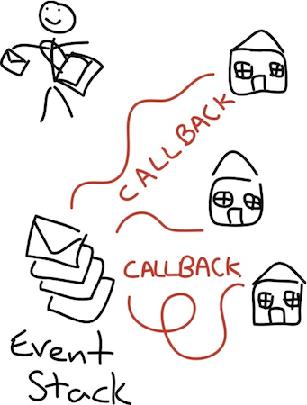

# NodeJS like a boss

---

## Our Presenters

## David Luecke

* GitHub: [daffl.github.com](http://daffl.github.com), Twitter: [@daffl](http://twitter.com/daffl)

## Eric Kryski

* GitHub: [ekryski.github.com](http://ekryski.github.com), Twitter: [@ekryski](http://twitter.com/ekryski)

---

## Our Sponsors

## Assembly Co-working Space

## PetroFeed

---

## Our Sponsors

## Startup Calgary

## Village Brewery

---

## Last Month

* Un-spaghetti and modularize your code
* Advanced selectors and DOM traversal
* Making your code faster
* Writing your own plugins
* Introduction to web components and Polymer
* Data driven views (or why direct DOM manipulation will be a thing of the past)
* Build web component style applications now with CanJS

---

## NodeJS

[Node.js](http://nodejs.org/) is a platform built on Chrome's V8 JavaScript runtime for easily building fast, scalable network applications.

* HTTP/HTTPS
* TCP/UDP Sockets
* Event Emitters
* Streams
* Files System Access
* Cross Platform

---

## How is Node Different?

It uses JavaScript and it is single event loop threaded. There is a seperate thread pool for IO requests. (Image credited to [Elegant Code](http://elegantcode.com/2011/07/05/taking-baby-steps-with-node-js-dont-block-the-event-loop/))

---

## Modules

### The [__N__ode __P__ackage __M__anager](https://npmjs.org)

- currently hosts ~63,000 modules
- easy to use (`npm install <package>`)
- easy to publish (`npm publish`)
- use it with anything (folders, tarballs, git repositories)

### [CommonJS](http://www.commonjs.org/)

- Attempt for JavaScript API standardization

---

## CommonJS modules

Provides global `module`, `exports` and `require()` to define this files API

	!javascript
	// module1.js
	exports.hello = 'World';
	// or
	module.exports = {
		hello: 'World'
	}

Using the module

	!javascript
	// main.js
	var mod1 = require('./module1');

	console.log(mod1.hello); // -> World

---

## package.json

CommonJS specification for describing JavaScript packages

		{
			"name": "node-up",
			"version": "0.1.0",
			"author": "YYCJS <people@yycjs.com>",
			"description": "Server side JavaScript FTW!",
			"scripts": {
				"test": "mocha test",
				"start": "node lib/main.js"
			},
			"main": "./lib/main.js",
			"repository": {
				"type": "git",
				"url": "https://github.com/yycjs/node-up"
			},
			"dependencies": {
				"somePackage": "> 1.0.0"
			},
			"devDependencies": {
				"some-dev-only-package":  "*"
			},
			"license": "MIT"
		}

---

## Web Development

 
Create `example.js` like this:

	!javascript
	var http = require('http');
	http.createServer(function (req, res) {
		res.writeHead(200, {'Content-Type': 'text/plain'});
		res.end('Hello World\n');
	}).listen(1337, '127.0.0.1');
	console.log('Server running at http://127.0.0.1:1337/');

And run it like:

	% node example.js
	Server running at http://127.0.0.1:1337/

---

## Serving Static Files

 

	!javascript
	var http = require("http");
	var url = require("url");
	var path = require("path");
	var fs = require("fs");

	http.createServer(function(request, response) {
		var uri = url.parse(request.url).pathname;
		var filename = path.join(process.cwd(), 'assets', uri);
		
		fs.readFile(filename, "binary", function(error, file) {
			if (error) {
				response.writeHead(500, {"Content-Type": "text/plain"});
				response.write(error + "\n");
				return response.end();
			}
			response.writeHead(200);
			response.write(file, "binary");
			response.end();
		});
	}).listen(1337, '127.0.0.1');
	console.log('Server running at http://127.0.0.1:1337/');

---

## Express

A sinatra inspired, web application framework. Its sort of the defacto.

---

## Socket.io

Bringing websockety goodness to your nodejs app. Has fallback to older technologies.

---

## Feathers

A minimal, real-time, data-driven, wrapper over top of Express that leverages the evented nature of nodejs.

---

## Next Month

* Client Side Frameworks?
